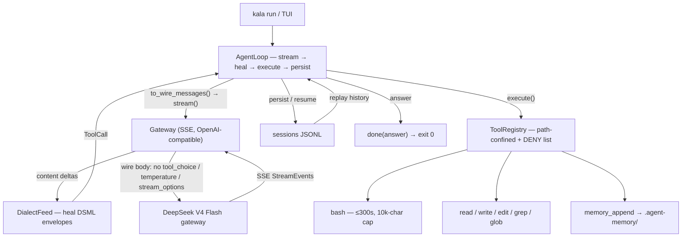

# kala

[](https://www.python.org/)
[](https://github.com/shivamnarkar47/kala)
[](https://github.com/shivamnarkar47/kala)
[](https://github.com/shivamnarkar47/kala/actions)
[](https://github.com/shivamnarkar47/kala)

kala is a DeepSeek V4 Flash agent harness: a Textual TUI plus a `kala run` CLI that drives gateway-backed agent sessions. The core is stdlib-only — `textual` is the only runtime dependency.

## Why "kala"?

kala (काल) means **Time** in Sanskrit. In the Bhagavad Gita (11.32), Krishna reveals himself to Arjuna as Kāla: *"kālo 'smi"* — *"I am Time, the destroyer of worlds."*

The name fits: kala is the orchestrator — it works the clock for you, running agents that think, read, and act while you don't. Time is the one resource it manages relentlessly.

The theme runs through the product: the harness (the mastermind, "KESHAVLOK") commands five default agent personas named after the Pandavas — Yudhishthira, Bhima, Arjuna, Nakula, Sahadeva.

## Requirements

- Python >= 3.12
- git (recommended; the installer falls back to a tarball without it)

## Install

Linux/macOS:

```sh
curl -fsSL https://raw.githubusercontent.com/shivamnarkar47/kala/main/install.sh | bash
```

Windows (PowerShell):

```powershell
powershell -c "irm https://raw.githubusercontent.com/shivamnarkar47/kala/main/install.ps1 | iex"
```

Both installers honor the `KALA_REPO_URL`, `KALA_INSTALL_DIR`, and `KALA_BIN_DIR` environment overrides, and re-running them updates an existing install.

## Usage

- `kala` — launch the Textual TUI
- `kala run "PROMPT"` — one-shot session from the CLI (`--dir`, `--model`, `--max-steps`, `--resume SESSION_ID`, `--json`, …); `--batch FILE --workers N` runs many prompts (one per line or a JSON array) as parallel sessions; `--no-tool-cache` and `--no-verify` disable the read-result cache and post-mutation verify hooks
- `kala sessions list` — list past sessions
- `kala sessions show|delete|prune` — inspect/delete/prune sessions; `kala doctor` — self-check; `kala run -` — read the prompt from stdin; `kala --version`
- TUI slash commands: `/help`, `/new`, `/resume <id>`, `/sessions`, `/connect`, `/structure`, `/memory`, `/model`, `/verbose`, `/quit`
- terminal font: Fira Sans Condensed — see `docs/terminal-setup.md`

The project tree is scanned automatically and cached in `.kala/STRUCTURE.md` (git-ignored, regenerable); it's injected into the system prompt and refreshed when files change. `.kala/` also holds the read-only tool-result cache (`tool-cache.json`, keyed to the tree signature, `--no-tool-cache` to disable) and optional verify hooks (`hooks.json`, run after mutating steps, `--no-verify` to disable).

## How it works



## API key

Set `OPENCODE_API_KEY` in your environment, or save a key from the TUI with `/connect` (resolution order: env → saved key → omp auth store).

## Tests

```sh
.venv/bin/python -m unittest discover -s tests -v
```

## Uninstall

Linux/macOS:

```sh
rm -rf ~/.local/share/kala ~/.local/bin/kala
```

Windows: delete the install dir (`%USERPROFILE%\.local\share\kala`) and the launcher (`%USERPROFILE%\.local\bin\kala.cmd`), then remove any `PATH` entry pointing at the bin dir.
