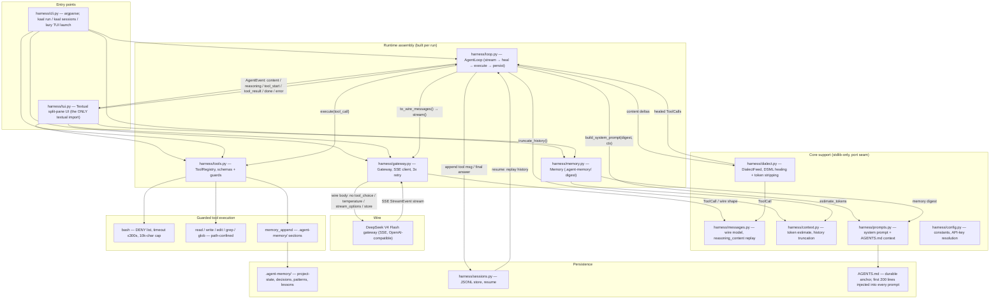

# kaal — Architecture Diagrams

Mermaid diagrams for the `kaal` agent harness. Render them with any Mermaid
viewer (GitHub, `mmdc`, VS Code extension).

## 1. Module architecture & data flow



## 2. One headless run — sequence

```mermaid
sequenceDiagram
    autonumber
    participant U as User
    participant CLI as harness/cli.py
    participant LOOP as harness/loop.py (AgentLoop)
    participant GW as harness/gateway.py (SSE)
    participant DL as harness/dialect.py (DialectFeed)
    participant TOOLS as harness/tools.py (ToolRegistry)
    participant SESS as harness/sessions.py (JSONL)

    U->>CLI: kaal run "PROMPT" [--dir, --model, --max-steps, --resume]
    CLI->>CLI: resolve API key (env OPENCODE_API_KEY → ~/.omp/agent/agent.db)
    CLI->>LOOP: AgentLoop(Gateway, Memory, ToolRegistry).run(prompt, emit)

    loop per turn (≤ max-steps)
        LOOP->>GW: stream(messages, tools)
        GW-->>LOOP: StreamEvent (content / reasoning / tool_call / done)
        LOOP->>DL: feed content deltas → heal DSML envelope
        LOOP->>LOOP: structured tool_calls win over healed ones
        alt tool calls present
            LOOP->>TOOLS: execute(call) — path-confinement + DENY list
            TOOLS-->>LOOP: result string (≤10k chars, truncation suffix)
            LOOP->>SESS: append tool message (persist)
            LOOP->>GW: next turn — replay reasoning_content verbatim
        else no tool calls
            LOOP->>SESS: append final answer
            LOOP-->>CLI: done(answer)
        end
    end

    CLI-->>U: answer to stdout (or --json line), exit 0/1/2
```

## Reading the diagram

- **Two hard things** live in the dashed path `GW → DIALECT → LOOP`: DSML
  healing (fullwidth-pipe `｜` U+FF5C envelope leaked into `content`) and
  mandatory `reasoning_content` replay (dropping it → HTTP 400 on turn 2+).
- **Port seam**: everything in `ENTRY`/`RUNTIME`/`CORE` is stdlib-only;
  `textual` appears only in `harness/tui.py`. The core maps 1:1 to a Rust/Go port.
- **Never sent on the wire**: `tool_choice`, `temperature`, `stream_options`,
  `store` — the model rejects them (`harness/gateway.py::_build_body`).
- **Loop exits**: answer produced (0) · config/key/gateway error (1) ·
  loop error — max steps, context overflow, tool loop, 5 consecutive tool
  failures (2).
